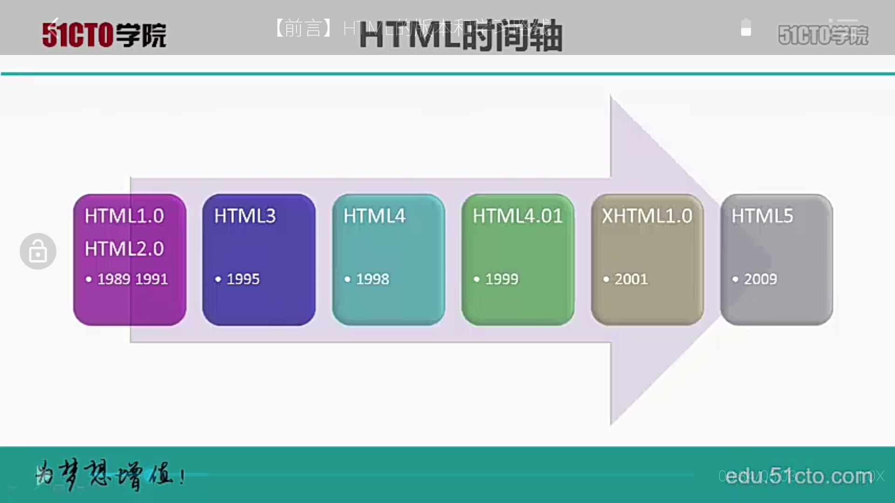

# HTML and CSS 学习笔记一

## 1. HTML 的版本发展历史

1. HTML 1.0-2.0
    - 1989、1991
    - HTML 刚刚诞生时只有几个最基本的标签。页面不好看，但是已经支持了超文本。几乎 Web 上的每个人都有自己的主页。
2. HTML 3
    - 19995
    - 浏览器战争
    - Web 开发人员通常必须写两个单独页面
3. HTML 4
    - 1998
    - W3C 成立，web 标准诞生
    - HTML 的结构和表现分离到两种语言  
      一种语言 用于实现结构（HTML）  
      一种语言用于表现（CSS）
4. HTML 4.01
    - 1999
    - 与 HTML 4相比做了一些简单的修补
5. XHTML 1.0
    - 2001
    - XML + HTML = XHTML    
    XHTML 的标准更严格
6. HTML 5
    - 2009
    - 延续使用 HTML4.01 大部分特性  
    提供了体现 web 新发展的新特性  
    完全支持 XHTML 风格的代码  
    HTML5 成为大家公认的标准
    
## 2. 万维网（world wide web）

1990 年，在 Robert Cailliau 的帮助下，Tim 创建了万维网、世界上第一个浏览器（world wide web）和世界上第一个网站

## 3. HTML：HyperText Markup Language 超文本标记语言
 
- HyperText：是指具有交互功能的文本
- Markup Language：通过特定的“Markup（标记）”在浏览器中展示相应的内容，如标题、段落、图片、表格、超链接等。

## 4. 万维网联盟：The World Wide Web Consortium

创建于 1994 年，是 Web 技术领域最具权威和影响力的国际中立性技术标准机构。

## 5. 常用的开发工具

- 记事本：编程效率低，代码不易阅读
- UltraEdit、EditPlus：列数标记、同时编辑多文件、HTML 标签颜色显示
- webstorm、sublime：代码智能完成、智能提示、前端开发神器

## 6.  HTML 标签

- 标题标签 heading tag：`<h1>`到`<h6>`，显示出来的文字依次从大到小
- 段落标签 paragraph tag：`
`
- 无序列表标签 unordered list：`<ur>`
- 列表项目标签 item list：`<li>`  
    `<li>`要写在`<ur>`标签内部  
    输入`ur > li`，Tab 键自动补全
- 有序列表标签 ordered list：`<ol>`  
    `<li>`为子标签，自动分配序号
- `<body>`：把所有显示在网页中的内容放入 `<body>` 标签中
- `<head>`：网页中的不可见部分放入 `<head>` 标签中        
- `<html>`：把所有HTML代码放入`<html>`标签中
- DOTYPE：表示 HTML 的版本信息（为 HTML 设置文档类型声明）
- `<title></title>`：浏览器中的标题标签

## 7. 文件乱码处理

因为编码方式不同而产生的乱码，本地 windows 的编码方式是 GBK 支持中文，而 webstorm 的编码方式是 UTF-8，支持所有语言。更改编码方式，解决乱码。

## 8. URL

- URL 包括：
    1. 协议
    2. 服务器
    3. 被请求文件
    
- **在浏览器中输入 URL 时发生了什么？**
    - 在浏览器中输入一个 URL 地址
    - 一个请求发送给服务器，服务器查找被请求文件。
    - 服务器把文件返回给浏览器，浏览器显示文件。  
    
    点击超连接和在地址栏中输入 URL 是一样的，只不过 URL 已经作为超链接中的一部分，实现写在了 HTML 的超链接标签中。

## 9. 如何制作超链接？
 
- a 标签：anchor 的缩写  ``

`<a href="http://.........">abc</a>`

- href: 是 HTML 属性，当超链接被点击的时候，页面被打开，是 hypertext reference 的缩写
- 路径
    - **绝对路径**向一个特定的服务器上的文件发送请求  
    当想要连接到其他网站/服务器上时，总是使用绝对路径
    - **相对路径**不能指定特定的服务器  
    当要连接的网页在相同的服务器上时，通常会使用相对路径
## 10. HTML 属性：

- 写在开始标签中
- 可以为标签添加额外的功能和信息

### target 属性
当超链接被点击时，新页面将在什么地方被打开

- 在新窗口打开页面  
`target="_blank"`
- 在当当前窗口打开页面  ,_self 是默认值  
`target="_self"`
        